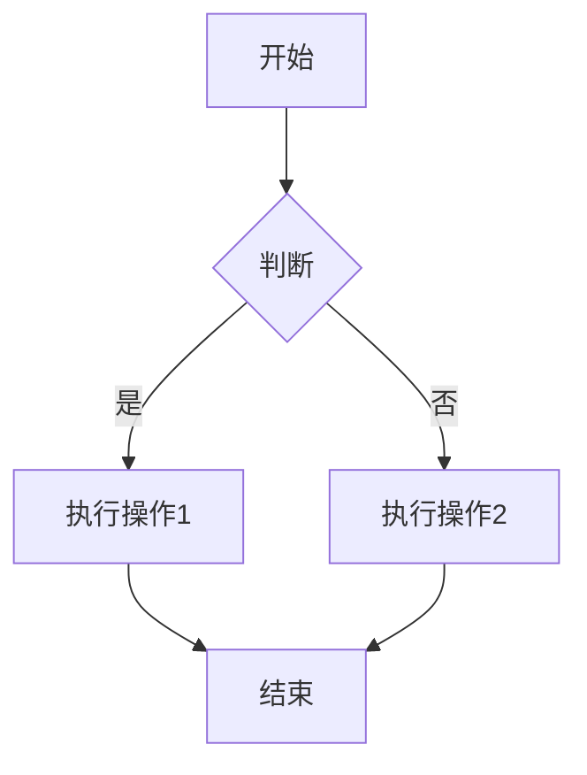
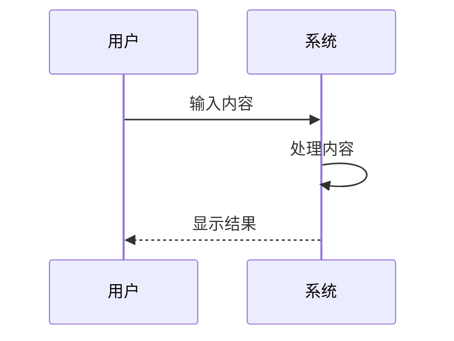
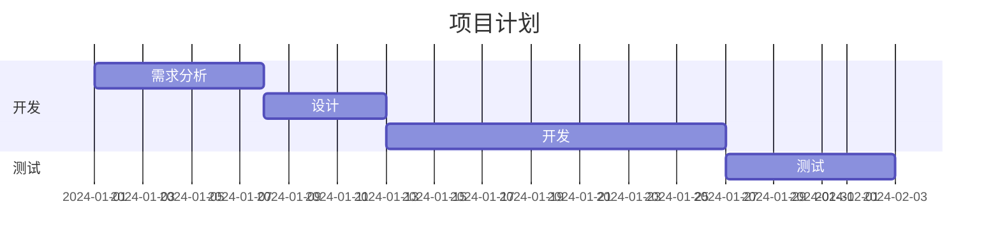

# Markdown Tauri App

一个基于 Tauri + React + TypeScript 构建的 Markdown 编辑器应用。

## 功能特点

- 📝 支持 Markdown 编辑和预览
- 🎨 支持代码高亮
- 📚 支持数学公式渲染
- 📊 支持 Mermaid 图表渲染（流程图、时序图、甘特图等）
- 🌙 支持深色/浅色主题切换
- 🚀 基于 Tauri 构建，性能优异

## 待办清单

### 已完成

- ✅ Markdown 基础编辑功能
- ✅ 代码高亮支持
- ✅ 数学公式渲染
- ✅ Mermaid 图表支持
- ✅ 主题切换功能

### 进行中

- 🔄 性能优化
- 🔄 文档完善

### 计划中

- ⏳ Tauri 应用打包
- ⏳ 本地文件系统集成
- ⏳ 导出 PDF 功能
- ⏳ 快捷键支持
- ⏳ 多语言支持

## 技术栈

- [Tauri](https://tauri.app/) - 构建跨平台桌面应用
- [React](https://reactjs.org/) - 用于构建用户界面
- [TypeScript](https://www.typescriptlang.org/) - 提供类型安全
- [Vite](https://vitejs.dev/) - 前端构建工具
- [Tailwind CSS](https://tailwindcss.com/) - 样式框架
- [Monaco Editor](https://microsoft.github.io/monaco-editor/) - 代码编辑器
- [Mermaid](https://mermaid.js.org/) - 图表渲染引擎

## 开发环境要求

- Node.js 18+
- pnpm 8+
- Rust 1.70+

## 安装和运行

1. 克隆项目

```bash
git clone https://github.com/your-username/markdown-tauri-app.git
cd markdown-tauri-app
```

2. 安装依赖

```bash
pnpm install
```

3. 开发模式运行

```bash
pnpm tauri dev
```

4. 构建应用

```bash
pnpm tauri build
```

## 部署到 GitHub Pages

1. 构建项目

```bash
pnpm build
```

2. 创建 gh-pages 分支

```bash
git checkout -b gh-pages
```

3. 复制构建文件到根目录

```bash
cp -r dist/* .
```

4. 提交更改

```bash
git add .
git commit -m "Deploy to GitHub Pages"
```

5. 推送到 GitHub

```bash
git push origin gh-pages
```

6. 在 GitHub 仓库设置中启用 GitHub Pages：
   - 进入仓库的 Settings 页面
   - 找到 Pages 设置
   - 选择 gh-pages 分支作为源
   - 点击 Save

## 项目结构

```
markdown-tauri-app/
├── src/                # 前端源代码
├── src-tauri/          # Tauri 后端代码
├── public/             # 静态资源
└── dist/               # 构建输出目录
```

## Mermaid 使用示例

### 流程图



### 时序图



### 甘特图



## 许可证

本项目采用 [MIT 许可证](LICENSE)。

## 贡献

欢迎提交 Issue 和 Pull Request！

## 在线演示

访问 [GitHub Pages](https://your-username.github.io/markdown-tauri-app/) 查看在线演示。
